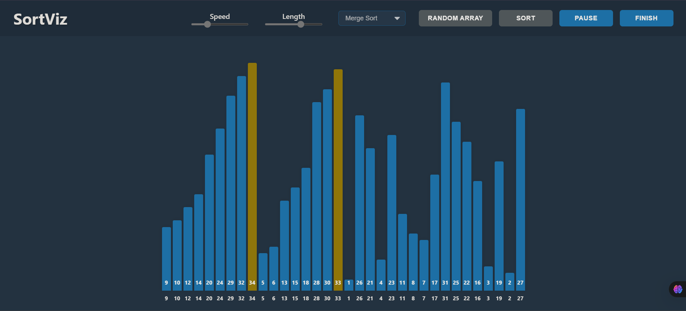

## **Overview**

SortViz is an interactive sorting algorithm visualizer built using React.js. It provides a clear and intuitive way to understand sorting algorithms through real-time visual updates.

## **Features**
### **Supported Sorting Algorithms**
- **Bubble Sort**
- **Selection Sort**
- **Heap Sort**
- **Quick Sort**
- **Merge Sort**

### **Visualization Details**
- Displays array elements as bars.
- Highlights key operations:
  - **Swaps** (color change when elements swap positions)
  - **Comparisons** (bars being compared are highlighted)
  - **Sorted Positions** (sorted elements are marked distinctly)
- Adjustable array size and speed controls.
- Responsive design for different screen sizes.

## **Technology Stack**
- **Frontend**: React.js, CSS

## **How to Run**

1. **Clone the Repository**:
   ```bash
   git clone https://github.com/shomik-das/SortViz.git
   cd SortViz
   ```

2. **Install Dependencies**:
   ```bash
   npm install
   ```

3. **Start the Application**:
   ```bash
   npm run dev
   ```

## **Learning Outcomes**
- Understanding the implementation of sorting algorithms.
- Enhancing React.js skills by managing state and rendering updates efficiently.
- Improving problem-solving skills through algorithm visualization.
- Developing an interactive UI with dynamic updates.
